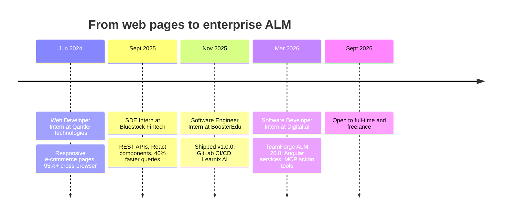
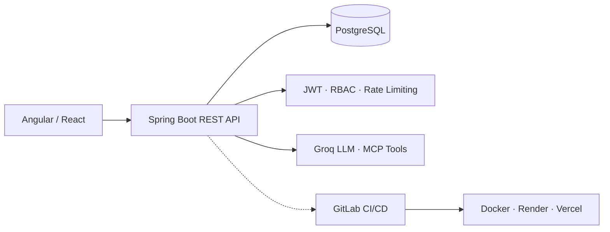
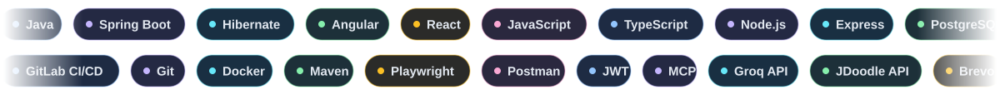

 

  

  

<h2 id="about" align="center"></h2>

<table>
<tr>
<td align="center" width="25%">ENTERPRISE <b>TeamForge ALM 26.0</b> Digital.ai</td>
<td align="center" width="25%">PRODUCT <b>BoosterEdu v1.0.0</b> Java · Spring Boot · React</td>
<td align="center" width="25%">AI <b>Learnix AI + MCP tools</b> Groq API</td>
<td align="center" width="25%">MENTORING <b>30+ students trained</b> 100+ DSA problems</td>
</tr>
</table>

 

I'm a software developer with **enterprise experience building Java and Angular applications**. I work across the stack, from Spring Boot services and PostgreSQL models to Angular and React interfaces, and I care about secure, maintainable, production-ready delivery.

> [!NOTE]
> I recently completed my internship at **Digital.ai (Mar – Sept 2026)** on the TeamForge ALM team, and I'm now open to **full-time roles and freelance projects**.

<table>
<tr>
<td width="50%" valign="top">

<b>QUICK FACTS</b>

| | |
|:--|:--|
| **Role** | Software Developer |
| **Last role** | Digital.ai · TeamForge ALM |
| **Core stack** | Java · Spring Boot · Angular · React |
| **Data** | PostgreSQL · MySQL · MongoDB · Redis |
| **Status** |  full-time and freelance |

</td>
<td width="50%" valign="top">

<b>WHAT I CARE ABOUT</b>

| | |
|:--|:--|
| **Secure by default** | JWT, BCrypt, RBAC, rate limiting |
| **Maintainable code** | Shared services, reusable components |
| **Shipping** | CI/CD, containers, uptime monitoring |
| **Confidence** | End-to-end tests with Playwright |
| **Sharing** | Mentoring and writing on my blog |

</td>
</tr>
</table>

<h2 id="impact" align="center"></h2>

  

<h2 id="journey" align="center"></h2>

<h2 id="services" align="center"></h2>

  

 

<table>
<tr>
<td align="center" width="20%"><b>01</b> BRIEF Send a short email brief</td>
<td align="center" width="20%"><b>02</b> SCOPE Approach, timeline and milestones</td>
<td align="center" width="20%"><b>03</b> BUILD Clean, documented code, secure defaults</td>
<td align="center" width="20%"><b>04</b> DEMO Regular demos and feedback</td>
<td align="center" width="20%"><b>05</b> DELIVER Deployed, tested and handed over</td>
</tr>
</table>

> [!TIP]
> **How I work:** clear scope, regular demos, clean and documented code, and secure defaults. Send a short brief by [email](mailto:mariaanthonyyokeshv6565@gmail.com) and I'll reply with an approach and timeline.

<h2 id="experience" align="center"></h2>

<table>
<tr>
<td width="50%" valign="top">

**Software Developer Intern** 
Digital.ai · Chennai 
 

- Developed enterprise features for **TeamForge ALM 26.0** with Java and Angular
- Built **reusable Angular services** shared across modules
- Migrated notifications to **ngx-toastr** across Angular and JSP
- Resolved **production defects** across the SDLC
- **Freestyle Week:** contributed to an **MCP server**, building action tools to create, update and delete ALM artifacts

</td>
<td width="50%" valign="top">

**Software Engineer Intern** 
BoosterEdu · Tirunelveli 
 

- Built **BoosterEdu v1.0.0** with Java, Spring Boot, React and PostgreSQL
- Set up **GitLab CI/CD** pipelines and deployment
- Integrated **Learnix AI** using the **Groq API** to summarize LMS content and generate context-based quizzes and technical interview questions for premium users

</td>
</tr>
<tr>
<td width="50%" valign="top">

**SDE Intern** 
Bluestock Fintech · Remote 

- Implemented **REST APIs** and reusable **React components** across projects
- Optimized PostgreSQL queries for a **40%** performance gain

</td>
<td width="50%" valign="top">

**Web Developer Intern** 
Qantler Technologies 

- Built responsive e-commerce pages with cart and billing modules
- Reached **95%+** cross-browser responsiveness

</td>
</tr>
</table>

<h2 id="projects" align="center"></h2>

<table>
<tr>
<td width="50%" valign="top">

**Impact Guard** 
ENTERPRISE LINE-LEVEL IMPACT ANALYZER

A **VS Code extension** that uses **AST parsers and dependency graphs** to show what a code change affects, down to the line.

</td>
<td width="50%" valign="top">

**TaskOrbit** 
ENTERPRISE TASK MANAGEMENT PLATFORM

Task platform with **REST APIs and role-based access control (RBAC)** on a modern Java and React stack (Java 17, Spring Boot 3.2, React 19).

</td>
</tr>
<tr>
<td width="50%" valign="top">

**BoosterEdu + Learnix AI** 
EDTECH PLATFORM WITH AN LLM ASSISTANT

Interactive learning content with AI summaries, quiz generation and interview-question practice.

 

</td>
<td width="50%" valign="top">

**JQuiz Platform** 
ONLINE ASSESSMENT PLATFORM

Secure authentication and quiz workflows for online assessments.

</td>
</tr>
</table>

<b>More projects</b>

 

| Project | Stack | Highlights |
|:--|:--|:--|
| **Full-Stack E-commerce Platform** | Java · Spring Boot · React · PostgreSQL | Authentication, catalog, search, cart and bill printing |
| **Real-Time Chat & AI Assistant** | React · Node.js · MongoDB · Groq | Live messaging, JWT security, Brevo OTP recovery |

<h2 id="approach" align="center"></h2>

| Focus | Practice |
|:--|:--|
| **Security** | JWT access and refresh tokens, BCrypt hashing, RBAC, rate limiting, OTP flows |
| **Quality** | Playwright end-to-end tests, reusable services and components |
| **Delivery** | GitLab pipelines, containerized deploys, uptime monitoring |
| **Modernization** | Legacy JSP to Angular, consistent shared service layers |

<h2 id="stack" align="center"></h2>

  

<table>
<tr>
<td align="center" width="25%">BACKEND  </td>
<td align="center" width="25%">FRONTEND  </td>
</tr>
<tr>
<td align="center">DATA  </td>
<td align="center">DEVOPS  </td>
</tr>
<tr>
<td align="center" colspan="2">TOOLS AND TESTING  </td>
</tr>
</table>

 

<h2 id="analytics" align="center"></h2>

  
  
    
  
    
  <b>CONTRIBUTION CALENDAR</b>
   
  

<h2 id="contact" align="center"></h2>

  

   

  

