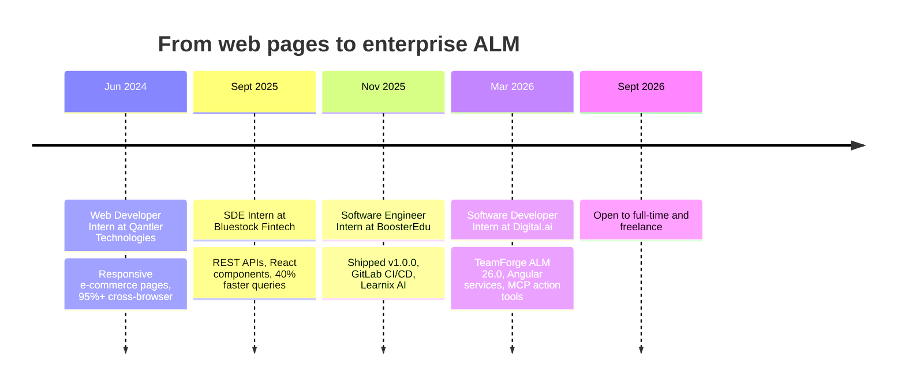
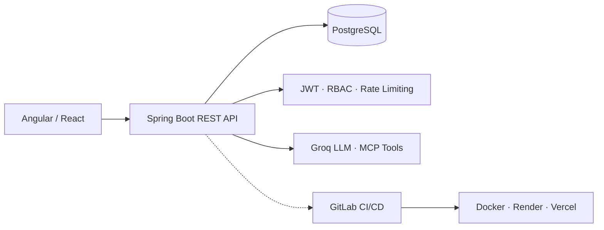

 

 

 

**[About](#-about-me)** · **[Impact](#-impact-at-a-glance)** · **[Journey](#-career-journey)** · **[Services](#-services-for-freelance-clients)** · **[Experience](#-experience)** · **[Projects](#-featured-projects)** · **[Stack](#-tech-stack)** · **[Contact](#-lets-work-together)**

## ✦ About Me

| 🏢 **Enterprise** | 🚀 **Product** | 🤖 **AI** | 🎓 **Mentoring** |
|:---:|:---:|:---:|:---:|
| TeamForge ALM 26.0 Digital.ai | BoosterEdu v1.0.0 Java · Spring Boot · React | Learnix AI + MCP tools Groq API | 30+ students trained 100+ DSA problems |

I'm a software developer with **enterprise experience building Java and Angular applications**. I work across the stack, from Spring Boot services and PostgreSQL models to Angular and React interfaces, and I care about secure, maintainable, production-ready delivery.

I recently completed my internship at **Digital.ai (Mar – Sept 2026)** on the TeamForge ALM team, and I'm now open to **full-time roles and freelance projects**.

<table>
<tr>
<td width="50%" valign="top">

#### 🧭 Quick Facts

| | |
|:--|:--|
| 💼 **Role** | Software Developer |
| 🏢 **Last role** | Digital.ai · TeamForge ALM |
| 🛠️ **Core stack** | Java · Spring Boot · Angular · React |
| 🗄️ **Data** | PostgreSQL · MySQL · MongoDB · Redis |
| 📬 **Status** | Open to full-time & freelance |

</td>
<td width="50%" valign="top">

#### 🎯 What I Care About

- 🔐 **Secure by default**: JWT, BCrypt, RBAC, rate limiting
- 🧱 **Maintainable code**: shared services, reusable components
- 🚢 **Shipping**: CI/CD, containers, uptime monitoring
- 🧪 **Confidence**: end-to-end tests with Playwright
- 🤝 **Sharing knowledge**: mentoring and writing on my blog

</td>
</tr>
</table>

## ✦ Impact at a Glance

  

## ✦ Career Journey

## ✦ Services for Freelance Clients

  

 

| 1️⃣ **Brief** | 2️⃣ **Scope** | 3️⃣ **Build** | 4️⃣ **Demo** | 5️⃣ **Deliver** |
|:---:|:---:|:---:|:---:|:---:|
| Send a short email brief | Approach, timeline and milestones | Clean, documented code with secure defaults | Regular demos and feedback | Deployed, tested and handed over |

> **How I work:** clear scope, regular demos, clean and documented code, and secure defaults. Send a short brief by [email](mailto:mariaanthonyyokeshv6565@gmail.com) and I'll reply with an approach and timeline.

## ✦ Experience

<table>
<tr>
<td width="50%" valign="top">

### 🏢 Software Developer Intern
**Digital.ai** · Chennai
`Mar 2026 – Sept 2026` 

- Developed enterprise features for **TeamForge ALM 26.0** with Java and Angular
- Built **reusable Angular services** shared across modules
- Migrated notifications to **ngx-toastr** across Angular and JSP
- Resolved **production defects** across the SDLC
- **Freestyle Week:** contributed to an **MCP server**, building action tools to create, update and delete ALM artifacts

`Java` `Angular` `ngx-toastr` `Spring Boot` `PostgreSQL` `Playwright` `GitLab` `MCP`

</td>
<td width="50%" valign="top">

### 🚀 Software Engineer Intern
**BoosterEdu** · Tirunelveli
`Nov 2025 – Feb 2026` 

- Built **BoosterEdu v1.0.0** with Java, Spring Boot, React and PostgreSQL
- Set up **GitLab CI/CD** pipelines and deployment
- Integrated **Learnix AI** using the **Groq API** to summarize LMS content and generate context-based quizzes and technical interview questions for premium users

`Java` `Spring Boot` `React` `PostgreSQL` `GitLab CI/CD` `Groq API`

</td>
</tr>
<tr>
<td width="50%" valign="top">

### 📈 SDE Intern
**Bluestock Fintech** · Remote
`Sept 2025 – Oct 2025`

- Implemented **REST APIs** and reusable **React components** across projects
- Optimized PostgreSQL queries for a **40%** performance gain

`React` `Node.js` `Express` `PostgreSQL`

</td>
<td width="50%" valign="top">

### 🌐 Web Developer Intern
**Qantler Technologies**
`Jun 2024`

- Built responsive e-commerce pages with cart and billing modules
- Reached **95%+** cross-browser responsiveness

`HTML5` `CSS3` `JavaScript` `AJAX`

</td>
</tr>
</table>

## ✦ Featured Projects

<table>
<tr>
<td width="50%" valign="top">

### 🔍 Impact Guard
*Enterprise Line-Level Impact Analyzer*

A **VS Code extension** that uses **AST parsers and dependency graphs** to show what a code change affects, down to the line.

`TypeScript` `Node.js` `VS Code API`

</td>
<td width="50%" valign="top">

### 📋 TaskOrbit
*Enterprise Task Management Platform*

Task platform with **REST APIs and role-based access control (RBAC)** on a modern Java and React stack.

`Java 17` `Spring Boot 3.2` `React 19` `PostgreSQL`

</td>
</tr>
<tr>
<td width="50%" valign="top">

### 🎓 BoosterEdu + Learnix AI
*Edtech platform with an LLM assistant*

Interactive learning content with AI summaries, quiz generation and interview-question practice.

`Spring Boot` `React` `Groq API` `GitLab CI/CD`

</td>
<td width="50%" valign="top">

### 📝 JQuiz Platform
*Online assessment platform*

Secure authentication and quiz workflows for online assessments.

`Spring Boot` `React`

</td>
</tr>
</table>

<b>More projects</b>

 

- 🛒 **Full-Stack E-commerce Platform** (Java, Spring Boot, React, PostgreSQL): authentication, catalog, search, cart and bill printing
- 💬 **Real-Time Chat & AI Assistant** (React, Node.js, MongoDB, Groq): live messaging, JWT security, Brevo OTP recovery

## ✦ Engineering Approach

| Focus | Practice |
|:--|:--|
| 🔐 **Security** | JWT access and refresh tokens, BCrypt hashing, RBAC, rate limiting, OTP flows |
| 🧪 **Quality** | Playwright end-to-end tests, reusable services and components |
| 🚢 **Delivery** | GitLab pipelines, containerized deploys, uptime monitoring |
| ♻️ **Modernization** | Legacy JSP to Angular, consistent shared service layers |

## ✦ Tech Stack

 

  

  

 

`Groq API` · `JDoodle API` · `Brevo` · `Render` · `UptimeRobot` · `JWT` · `MCP` · `Agile`

## ✦ GitHub Analytics

  
  
   
  
   
  

## ✦ Let's Work Together

  

   

  

